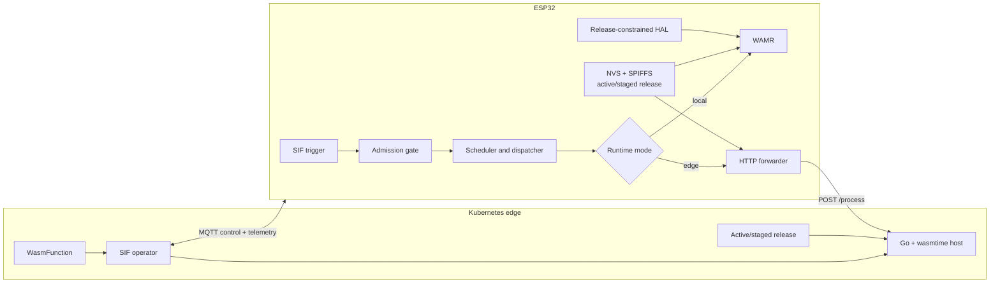

# Migrating Serverless Functions in the IoT-Edge Continuum

This repository contains the thesis-specific part of the SIF-Wasm prototype.
It runs the same Rust WebAssembly function on an ESP32 or an edge Kubernetes
node. The ESP32 remains the event source and SIF scheduler. A Kubernetes
operator controls release delivery and execution placement; a Go host provides
remote Wasm execution and the matching host API.

The prototype builds on a companion contribution to
[CAPS-IoT/SIF](https://github.com/CAPS-IoT/SIF). That contribution adds the
generic WAMR-backed `WasmFunction` and lets SIF pause new invocations of one
function while already admitted invocations finish. This repository owns the
firmware application, WAMR platform adaptation, Wasm guests, edge host,
operator, and release/placement protocols.

The implemented continuum currently spans the IoT device and edge tiers. It
does not implement a cloud destination, Kubernetes Wasm CRI shim, guest OCI
unpacking on the ESP32, or Xtensa AoT execution.

## Current status

As of 2026-07-22, the prototype implementation is complete for the thesis
demonstrator and has been exercised on the ESP32 and edge cluster. The current
live baseline includes:

- generation-bound staging and activation on both runtimes;
- stable, idempotent MQTT commands with QoS 1 and telemetry acknowledgement;
- local WAMR execution, remote wasmtime execution, and logical hybrid
  execution with device-side input collection and output application;
- battery-threshold, rolling-drain, resource-locality, readiness, and
  destination-only deadline admission;
- soft deadline rejection per fresh invocation observation and hard
  low-battery override;
- a declarative simulated-battery source for repeatable demonstrations; and
- physically verified common-anode RGB output, including deadline-rejection
  signaling and actuator-state restoration across placement reboots.

The exact evidence boundary and remaining hardening work are maintained in
[Traceability and Status](technical/03-traceability-and-status.md).

## Canonical documentation

Project documentation is intentionally limited to the following files:

| Document | Purpose |
|---|---|
| [Technical documentation](technical/README.md) | Thesis-oriented system design, implementation, and evidence index. |
| [ESP32 firmware README](SIF_wasm_dht/README.md) | Firmware configuration, build, flash, runtime, and control reference. |
| [Edge README](edge/README.md) | Edge host, operator, registry, and deployment boundary. |
| [Edge host README](edge/host/README.md) | HTTP API, release slots, environment, and local validation. |
| [Operator README](edge/operator/README.md) | `WasmFunction` API, reconciliation, placement, commands, and tests. |
| [Wasm guests README](wasm_guests/README.md) | Guest ABI, resource contracts, build, memory gate, and publication workflow. |

Historical implementation plans, handoffs, requirements notes, and duplicate
guides have been removed. Current behavior is documented only in the files
listed above.

## Repository map

```text
SIF_wasm_dht/       ESP-IDF application, WAMR host, release manager, MQTT/HTTP
wasm_guests/        Rust guests and generation-bound publication scripts
edge/host/          Go + wasmtime execution host
edge/operator/      Kubebuilder control-plane operator and WasmFunction CRD
edge/k8s/           Zot registry manifest for container images
technical/          Canonical thesis-oriented technical documentation
tools/tests/        Host-buildable firmware policy tests
```

An external SIF checkout supplies the scheduler, dispatcher, resources,
`WasmFunction`, and admission gate used by the firmware build.

The Kubernetes object, Service, image path, and stable artifact slot retain the
compatibility name `dht-reader`/`dht_reader.wasm`. The active guest identity is
release metadata: currently either `basic-edge-demo` or
`hybrid-resource-demo`.

## Architecture at a glance



Logical `hybrid` placement uses concrete ESP32 runtime mode `edge`: the device
collects contract-declared local inputs, the host runs the guest, and the
device verifies the executed release before applying declared local outputs.

## SIF and WAMR dependencies

Use a SIF checkout that contains the companion contribution and point the
firmware build to it:

```bash
export SIF_BASE_DIR=/path/to/SIF
```

The generic `WasmFunction` in that checkout loads a module from embedded
bytecode or a file and calls its exported `process_event` function.

Before the first firmware build, initialize this repository's WAMR component:

```bash
git submodule update --init SIF_wasm_dht/components/wamr
```

The companion SIF contribution remains pinned to upstream WAMR. The local
firmware component uses the thesis fork, which adds one reusable 64 KiB
linear-memory slot for ESP-IDF. Keeping that platform-specific adaptation here
avoids making it a requirement of the generic SIF framework. WAMR's nested test
submodules are not needed.

Applications initialize WAMR before starting the scheduler and register any
native imports their modules use. These imports, such as sensor-access
functions, remain outside the SIF framework. `WasmFunction::reloadFromPath()`
changes the module used by later invocations; an invocation already in progress
continues with its existing bytecode.

## Quick local validation

The component READMEs contain prerequisites and operating details. From the
repository root, the main non-live checks are:

```bash
go -C edge/host test ./...
GOCACHE="$PWD/.go-cache" make -C edge/operator test

cargo test --manifest-path wasm_guests/hybrid_resource_demo/Cargo.toml
(cd wasm_guests/basic_edge_demo && \
  cargo build --release --target wasm32-wasip1)
(cd wasm_guests/hybrid_resource_demo && \
  cargo build --release --target wasm32-wasip1)

source /path/to/esp-idf-v5.4.1/export.sh
export SIF_BASE_DIR=/path/to/SIF
idf.py -C SIF_wasm_dht build
```

Guest publication scripts, image pushes, cluster changes, MQTT commands,
firmware flashing, and serial monitoring affect external state. Review the
component READMEs and the active environment before running them.

## Security and repository hygiene

Keep Wi-Fi credentials, MQTT tokens, kubeconfigs, private registry credentials,
serial-port names, and machine-specific addresses out of committed files. The
prototype verifies raw Wasm bytes with SHA-256 but does not provide artifact
signatures or complete endpoint authentication; deployment networking is part
of its trust boundary.

Generated firmware build directories, Rust `target/` directories, local
configuration, logs, and machine metadata are not canonical source or
documentation.
