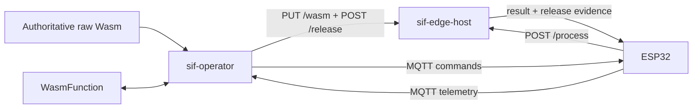

# SIF-Wasm Edge Tier

`edge/` contains the remote execution and Kubernetes control-plane side of the
SIF-Wasm prototype.

```text
host/       Go HTTP service embedding wasmtime
operator/   Kubebuilder operator and WasmFunction CRD
k8s/        Zot registry manifest for container images
```

The detailed architecture is in [`technical/`](../technical/README.md). Use
the [edge-host README](host/README.md) and [operator README](operator/README.md)
for component-specific commands.

## Runtime relationship



The edge host is a standard container running Go and wasmtime. Kubernetes does
not run the guest through a Wasm CRI shim. Zot stores the edge-host and operator
container images; the current ESP32 guest path remains verified raw Wasm over
HTTP.

## Release flow

1. A publication workflow atomically changes release generation, raw-Wasm
   digest, logical identity, and resource contract.
2. The operator verifies the authoritative source digest.
3. The host stages and compiles the tuple without changing the active release.
4. The ESP32 stages and verifies the same bytes through an MQTT command.
5. The operator activates only the accepted logical placement.
6. Device telemetry and host `/release` state establish convergence.

The compatibility Kubernetes object, Service, artifact path, and container file
remain `dht-reader`/`dht_reader.wasm`; `spec.release.functionIdentity` names the
guest that actually executes.

## Local checks

```bash
go -C edge/host test ./...
GOCACHE="$PWD/.go-cache" go -C edge/operator test ./...
GOCACHE="$PWD/.go-cache" make -C edge/operator test
```

The test suites use localhost HTTP/MQTT listeners and may require an execution
environment that permits loopback sockets.

## Container images and registry

Each component has its own Dockerfile:

```bash
docker build -t <registry>/sif-edge-host:<tag> edge/host
docker build -t <registry>/sif-operator:<tag> edge/operator
```

Use immutable tags or digests for reproducible thesis runs. Pushing an image or
updating a Kubernetes Deployment changes external state.

[`k8s/registry.yaml`](k8s/registry.yaml) deploys a single Zot instance with an
ephemeral `emptyDir` and NodePort 30500. It is suitable for the demonstrator,
not a durable production registry. Adapt namespace, storage, network policy,
and authentication for another environment.

## Cluster-internal Wasm source

Zot and `wasm-source` serve different artifacts. Zot stores the operator and
edge-host container images. The `wasm-source` pod serves the authoritative raw
Wasm module that the operator verifies and stages in the edge host.

The demonstrator runs `wasm-source` as one nginx pod behind the
`wasm-source` Service. A ConfigMap key named `wasm` is mounted at
`/usr/share/nginx/html/wasm`, and the Service exposes that file as
`http://wasm-source.sertay:8080/wasm`. This address is assigned to
`spec.device.operatorWasmURL`; it is reachable inside the cluster and is not
the URL used by the ESP32.

The `wasm-source` Deployment and Service must exist before running a guest
`publish.sh` script. The script does not create these resources. It creates a
new timestamped ConfigMap, changes the Deployment to mount that ConfigMap, and
waits for the replacement pod to become ready before updating the release
digest. The ESP32 obtains the same bytes separately through
`spec.device.artifactURL`, as described below.

## Development network paths

The demonstrator uses three separate laptop-facing network paths. They are not
interchangeable:

| Operation | Laptop endpoint | Purpose |
|---|---|---|
| Publish operator or edge-host container images | `127.0.0.1:30500` | Forward local Docker pushes to the Zot registry on the edge node. |
| Distribute a Wasm release to the ESP32 | `<laptop-LAN-IP>:8081/wasm` | Serve the raw Wasm bytes named by `spec.device.artifactURL`. |
| Offload an ESP32 invocation | `<laptop-LAN-IP>:8080/process` | Forward the request to the current `dht-reader` edge-host Service. |

The commands below assume SSH alias `edge-01`, namespace `sertay`, and Service
name `dht-reader`. Long-running tunnel and server commands remain in the
foreground; keep each required command open in a separate terminal. Replace
the environment-specific names and addresses for another deployment.

### Container registry tunnel

Open a loopback-only tunnel before pushing a newly built operator or edge-host
image from the laptop:

```bash
ssh -N \
  -L 127.0.0.1:30500:127.0.0.1:30500 \
  edge-01
```

In another terminal, tag and push the images through `localhost:30500`:

```bash
curl -fsS http://127.0.0.1:30500/v2/
SIF_IMAGE_TAG="$(date -u +%Y%m%d-%H%M%S)"

docker build --platform linux/amd64 \
  -t "localhost:30500/sif-operator:${SIF_IMAGE_TAG}" edge/operator
docker push "localhost:30500/sif-operator:${SIF_IMAGE_TAG}"

docker build --platform linux/amd64 \
  -t "localhost:30500/sif-edge-host:${SIF_IMAGE_TAG}" edge/host
docker push "localhost:30500/sif-edge-host:${SIF_IMAGE_TAG}"
```

Use the new operator tag in the manager Deployment and the new edge-host tag in
`WasmFunction.spec.image`. The tunnel transfers image pushes from the laptop;
it is not part of invocation execution and need not remain open after the
images have reached Zot. Kubernetes pulls `localhost:30500/...` directly from
the registry exposed on the edge node.

### Device-reachable Wasm artifact service

Start the repository artifact server when the ESP32 must stage a newly
published Wasm release:

```bash
python3 tools/wasm_artifact_server.py \
  --bind 0.0.0.0 \
  --port 8081 \
  edge/host/dht_reader.wasm
```

The guest publication scripts replace `edge/host/dht_reader.wasm`. The server
detects that replacement and serves the current bytes at `/wasm` together with
their SHA-256 digest. Set `spec.device.artifactURL` to
`http://<laptop-LAN-IP>:8081/wasm`. When the operator sends `stage_release`, the
ESP32 downloads these bytes, verifies the declared digest, and stores the
release as staged before activation.

The operator normally reads the same release through the cluster-internal
`spec.device.operatorWasmURL`. The device-facing and operator-facing URLs may
differ, but both must return identical bytes. Keep the artifact server running
until device telemetry acknowledges the staged or activated release.

```bash
curl -fsS http://127.0.0.1:8081/health
curl -fsSI http://127.0.0.1:8081/wasm
```

### ESP32-to-edge invocation tunnel

The edge-host Service receives a dynamically allocated NodePort. Resolve the
current value and use it as part of the SSH forward:

```bash
SIF_EDGE_NODEPORT="$(
  ssh edge-01 \
    "kubectl -n sertay get svc dht-reader \
      -o jsonpath='{.spec.ports[0].nodePort}'"
)"
printf 'edge-host NodePort: %s\n' "$SIF_EDGE_NODEPORT"

ssh -N \
  -L "0.0.0.0:8080:127.0.0.1:${SIF_EDGE_NODEPORT}" \
  edge-01
```

Do not enter `${SIF_EDGE_NODEPORT}` by itself: the shell expands the variable
to a number such as `30783` and then tries to execute that number as a command.

The tunnel exposes the remote `/process` endpoint through the laptop. Configure
the firmware edge-host URL as
`http://<laptop-LAN-IP>:8080/process`. Keep this tunnel open while edge or
logical hybrid placement is executing, and resolve the NodePort again if the
Service is recreated.

```bash
curl -fsS http://127.0.0.1:8080/health
```

Binding ports 8080 or 8081 to `0.0.0.0` makes them reachable from the laptop's
network interfaces. Use this only on a trusted demonstrator network and allow
the ports through the host firewall only when required.

## Deployment order

A clean deployment normally follows this order:

1. provide a reachable container registry and publish immutable host/operator
   images;
2. install the generated `WasmFunction` CRD;
3. create the MQTT token Secret without printing the token;
4. deploy the operator and deadline-profile ConfigMap;
5. deploy an authoritative raw-Wasm source reachable by the operator and
   device;
6. apply a `WasmFunction` with one complete release tuple; and
7. observe operator status, host `/release`, device telemetry, and serial logs.

The checked-in sample is
[`operator/config/samples/edge_v1alpha1_wasmfunction.yaml`](operator/config/samples/edge_v1alpha1_wasmfunction.yaml).
Review every environment-specific value before applying it. The image tag,
artifact URL, and zero digest require replacement; the checked-in topic IDs are
demonstration defaults rather than universal values.

## Security boundary

The prototype assumes a trusted deployment network. SHA-256 binds bytes but
does not authenticate the publisher. The host endpoints do not yet provide
complete authentication, request-body limits, or execution fuel, and the
registry manifest has no durable storage or access control.

Never commit MQTT tokens, registry credentials, kubeconfigs, personal host
addresses, or active device topics.
