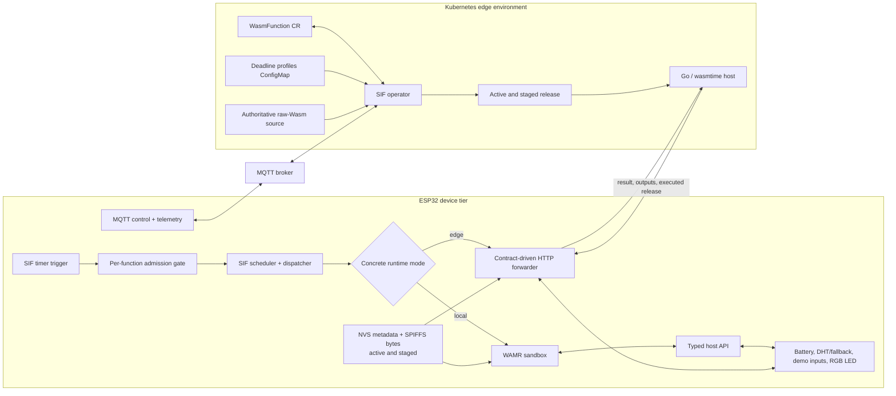
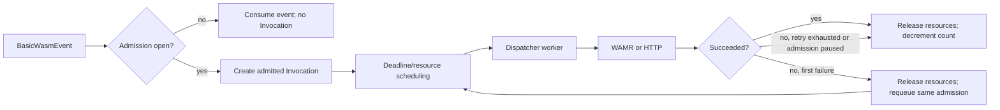
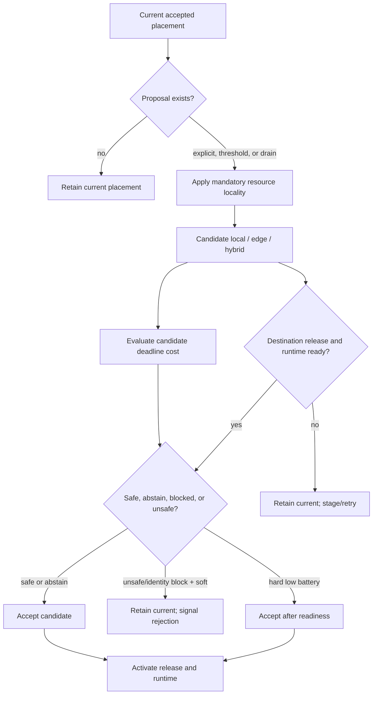

# System Design

## 1. Purpose and scope

SIF-Wasm extends the Serverless IoT Programming Framework (SIF) with a
portable, sandboxed function and an energy-aware execution continuum. The
ESP32 remains responsible for sensing, event creation, resource management,
and invocation scheduling. A release can execute locally through WebAssembly
Micro Runtime (WAMR) or remotely through an edge host. A Kubernetes operator is
the authoritative release and placement control plane.

The migration unit is application logic and its release contract. The system
does not migrate a live stack, heap, continuation, or partially executed
invocation.

The implemented continuum contains two execution destinations:

- **IoT/device:** ESP32 + ESP-IDF/FreeRTOS + SIF + WAMR.
- **Edge:** Kubernetes-managed Linux container + Go + wasmtime.

A cloud executor is not implemented. The current artifact path is verified raw
Wasm over HTTP, not guest OCI-layer resolution on the device.

## 2. Design goals and constraints

The design is driven by six constraints.

1. **One guest, two hosts.** The same core-Wasm module and `process_event`
   export must execute on WAMR and wasmtime.
2. **Absolute host/guest isolation.** Guest code cannot access ESP32 registers,
   drivers, or edge process state directly. All interaction crosses a typed
   host API.
3. **Release consistency.** Artifact bytes, function identity, and resource
   permissions change together under one monotonically increasing generation.
4. **Energy-aware placement.** Battery state and drain can propose a new
   destination, but feasibility, readiness, and deadline policy constrain the
   transition.
5. **Invocation-boundary activation.** A release or runtime-mode change must
   not replace code beneath a running invocation.
6. **Bounded device memory.** WAMR, Wasm linear memory, bytecode, task stacks,
   telemetry, and release transitions require explicit bounds because the
   ESP32 has no virtual-memory safety net.

## 3. System context



### 3.1 Component responsibilities

| Component | Responsibility |
|---|---|
| SIF trigger and scheduler | Create timestamped events, apply per-function admission, build deadline-ordered invocations, and coordinate resources. |
| SIF dispatcher | Execute one admitted subscriber on the worker pool, release resources, retry at most once, and complete admission accounting. |
| Device release manager | Verify and stage bytes, persist release state, drain invocations, activate at a boundary, and acknowledge state. |
| WAMR host | Instantiate a bounded sandbox per local invocation and expose the release-constrained host API. |
| HTTP forwarder | Collect only declared supported inputs, call the edge host, verify release evidence, and apply only declared outputs. |
| Edge host | Maintain active/staged compiled releases and execute only requests bound to the active identity and generation. |
| Kubernetes operator | Reconcile the host workload, synchronize releases, resolve placement policy, publish idempotent commands, and maintain status. |
| MQTT bridge | Carry device control and state/invocation telemetry; transport acknowledgement is distinct from application convergence. |

The edge Deployment remains available during local placement so that the next
release and remote destination can be prepared in advance.

## 4. Execution model

### 4.1 SIF invocation lifecycle

A `BasicWasmTrigger` emits a `BasicWasmEvent` every 15 seconds. The scheduler
matches the event to the generic `wasmProcess` subscriber. Admission is checked
before an `Invocation` is allocated.



The local and remote subscriber both use a ten-second SIF deadline. Deadline
telemetry measures queue, execution, network, collection, and output phases;
the operator uses those components for future transition admission rather than
moving an invocation that is already running.

### 4.2 Concrete and logical placement

The device has two concrete runtime modes:

- `local`: WAMR is initialized and the guest runs on the ESP32;
- `edge`: WAMR is not initialized and the subscriber calls the edge host.

The control plane exposes three logical placements:

| Logical placement | ESP32 runtime | Input/output behavior |
|---|---|---|
| `local` | `local` | Guest and declared resource access remain on the device. |
| `edge` | `edge` | Guest runs remotely and the release has no device-local contract member. |
| `hybrid` | `edge` | Device collects declared local inputs and applies declared local outputs around remote execution. |

Hybrid is therefore a data-locality property, not a third firmware runtime.

## 5. Host-guest contract

Both hosts expose the current imports from module `env`:

```text
get_resource_f32(resource_ptr, resource_len, key_ptr, key_len) -> f32
get_resource_i32(resource_ptr, resource_len, key_ptr, key_len) -> i32
get_resource_bool(resource_ptr, resource_len, key_ptr, key_len) -> i32
set_output_i32(key_ptr, key_len, value)
set_output_f32(key_ptr, key_len, value)
log_message(message_ptr, message_len)
```

The guest exports:

```text
process_event() -> i32
```

A return value of zero is SIF execution success. Application results such as
`actuatorCommand` cross the setter interface rather than using the return code.

The release contract is a capability set. On the ESP32, an input or output is
allowed only if its exact name and type are compiled into the active policy.
In edge mode the same contract controls request construction and output
application. The edge host validates Wasm string ranges, while WAMR native
signatures translate and validate guest pointer/length pairs before entering
the firmware wrappers.

## 6. Generation-bound release model

### 6.1 Atomic release tuple

A release is defined as:

```text
Release = {
  generation,
  SHA-256(raw Wasm bytes),
  function identity,
  complete typed input/output resource contract
}
```

Changing any member requires a greater generation. Reusing a generation with
different bytes, identity, or contract is a conflict. Digest equality alone is
not sufficient: the same Wasm bytes may legitimately appear under a later
generation, so activation and invocation matching use the full release
identity.

### 6.2 Active and staged slots

Both the device and edge host distinguish staged from active releases.

```mermaid
stateDiagram-v2
    [*] --> ActiveN
    ActiveN --> StagedN1: verify generation N+1
    StagedN1 --> ActiveN: continue executing N
    StagedN1 --> Draining: activation selected
    Draining --> ActiveN1: boundary reached; promote tuple
    ActiveN1 --> [*]
```



Staging prepares a destination without selecting it. Activation changes the
executing release at an invocation boundary. An invocation that began under N
finishes under N.

### 6.3 Release authority and delivery

The operator is the release authority:

1. A publication workflow updates the authoritative bytes and the complete
   `spec.release` tuple.
2. The operator hashes the source and rejects a digest mismatch.
3. It stages the edge host through `PUT /wasm` with generation, digest, and
   identity headers.
4. It publishes `stage_release` so the ESP32 fetches the same bytes, verifies
   the digest, and persists its staged tuple.
5. It activates only the accepted placement.

`ArtifactSynchronized=True` means both runtimes hold the desired tuple in an
active or staged slot. It does not mean both destinations execute it.

## 7. Communication planes

The architecture separates three planes.

| Plane | Path | Purpose |
|---|---|---|
| Control | MQTT between operator and ESP32 | Stage, activate, pause/resume, policy synchronization, diagnostics, and telemetry acknowledgement. |
| Invocation | HTTP `POST /process` from ESP32 to host | Typed invocation inputs and verified result/output metadata. |
| Release | HTTP source to operator/device and operator to host | Verified raw-Wasm staging and explicit activation. |

MQTT uses QoS 1. Broker `PUBACK` proves broker acceptance, not application
state. The operator uses later device telemetry containing the expected mode,
generation, digest, and identity as convergence evidence. Stable command and
decision identifiers make retries and duplicate QoS-1 delivery idempotent.

## 8. Placement and transition admission

### 8.1 Decision structure

The control plane starts from the last accepted logical placement. A transition
requires a proposal; deadline cost never generates a destination by itself.



The source computes the deadline evaluation while resolving the candidate and
then applies the readiness gate before any destination command. Conceptually,
both readiness and deadline admission must permit a soft transition.

### 8.2 Proposal policy

Proposal priority is:

1. hard low-battery remote proposal from local placement;
2. explicit `local` or `edge` mode;
3. high-battery local return in `auto` mode;
4. confirmed rolling battery-drain remote proposal;
5. otherwise retain the accepted placement.

Battery threshold hysteresis prevents immediate oscillation. Drain requires
consecutive risky windows and resets on a battery-source, function, runtime, or
telemetry-continuity change.

`spec.device.batterySimulation` supplies a deterministic demonstration source.
The request is acknowledged only when later telemetry reports `simulated` or
`real` as requested.

### 8.3 Mandatory resource locality

Any input or output whose locality is `device` converts a remote `edge`
proposal into `hybrid`. This rule is not optional. If a new release removes all
device-local members, retained logical `hybrid` normalizes to `edge` without a
redundant concrete-mode command.

### 8.4 Destination readiness

A local candidate requires the desired release active or staged on the device.
An edge/hybrid candidate requires:

- an available edge host replica;
- the desired host release active or staged; and
- the desired device release active or staged, because the device owns the
  contract and request identity even during remote execution.

### 8.5 Destination-only deadline admission

For target deadline $D$ and safety margin $S$:

$$C_{local}=Q+W+E_{local}+S$$

$$C_{edge}=N+E_{edge}+S$$

$$C_{hybrid}=I+N+E_{edge}+O+S$$

where $Q$ is queue delay, $W$ resource wake time, $N$ network round trip,
$I$ input collection, and $O$ local output application. Candidate slack is:

$$slack=D-C_{candidate}$$

A safe candidate meets `minSlackMs`. Missing target or estimates causes
admission to abstain without blocking an otherwise ready transition. Unknown
or mismatched function identity blocks a soft transition. An unsafe soft
candidate is rejected. Low battery is a hard guardrail and may override timing
risk only after destination readiness is established.

Timing fallbacks come from the mounted `deadline-profiles` ConfigMap. After a
minimum sample count, the in-memory estimator uses per-function, per-mode
rolling observations.

### 8.6 Rejection and hard-pending semantics

For a soft rejection, the controller:

- keeps the current accepted placement;
- sends no activation command to the rejected destination;
- continues background release staging;
- activates a new release only at the retained placement; and
- emits one blue two-pulse signal for each fresh rejected telemetry
  observation, while deduplicating reconciles and MQTT redelivery.

For a hard low-battery transition whose destination is not ready, the operator
persists a function pause. Already admitted invocations drain; new trigger
events create no invocation. Admission resumes only after telemetry confirms
the accepted concrete mode, release generation, and digest.

## 9. Activation and acknowledgement

### 9.1 Local activation

`activate_local` selects a staged generation, drains admitted work, reloads the
canonical WAMR bytecode, promotes SPIFFS and NVS state, updates the active
contract, and selects local mode. A same-mode release activation updates the
long-lived SIF subscriber name to the release identity.

### 9.2 Remote activation

For edge/hybrid placement, the operator first ensures that the full desired
release tuple is active on the host. It then sends `set_runtime_mode` to
activate the same generation and contract on the device and select concrete
mode `edge`. The host rejects `/process` unless request identity and generation
match its active release; the device rejects response outputs unless identity,
generation, digest, and output declaration match its active tuple.

## 10. Observability and status

`WasmFunction.status` contains four conditions:

| Condition | Meaning |
|---|---|
| `Available` | The owned Deployment and Service have been reconciled. |
| `ArtifactSynchronized` | Host and device hold the desired release active or staged, or synchronization is pending/failed. |
| `DeadlineAdmission` | The candidate was accepted, rejected, overridden, blocked, or not evaluated. |
| `PlacementCommanded` | Placement converged, a command was sent, telemetry/readiness is pending, or the transition was rejected. |

Scalar status records the desired and observed release tuple, active/staged
digests and generations, selected/observed identity, proposal and candidate,
cost/slack, runtime mode, admission pause, battery/drain observations,
application-level delivery state, command identifiers, and retry timestamps.

## 11. Concurrency and failure containment

- The SIF worker count for this path is one. This matches the single reusable
  Wasm linear-memory slot and avoids reserving a second large invocation stack;
  the dispatcher releases resources before retry or terminal deletion.
- WAMR canonical bytecode replacement and per-invocation copying share one
  mutex; each invocation executes its own scratch copy.
- Device staging and activation share one static transition worker and cannot
  overlap.
- The edge host holds one mutex across release matching, Store/Instance
  creation, guest execution, output capture, and host activation.
- LED steady output and deadline overlay share one mutex and ownership policy.
- Stable command IDs, full release matching, and telemetry acknowledgement make
  control operations safe under reconcile and MQTT duplication.

## 12. Trust boundary and non-goals

The Wasm sandbox constrains guest memory and host capabilities, but the
prototype is not a complete zero-trust deployment:

- SHA-256 establishes byte equality, not publisher authenticity.
- HTTP endpoints do not implement complete authentication or TLS policy.
- The edge host has no request-body limit and no guest fuel/interruption.
- Device file promotion and NVS promotion are not one cross-subsystem atomic
  transaction.
- Some demo providers are fixed or emulated; arbitrary resource contracts do
  not dynamically create firmware drivers.

The design deliberately does not claim live process migration, cloud
placement, guest OCI consumption, a Wasm CRI runtime, AoT execution, or general
string-resource support. Source realization and the exact validated subset are
covered in the next two documents.
